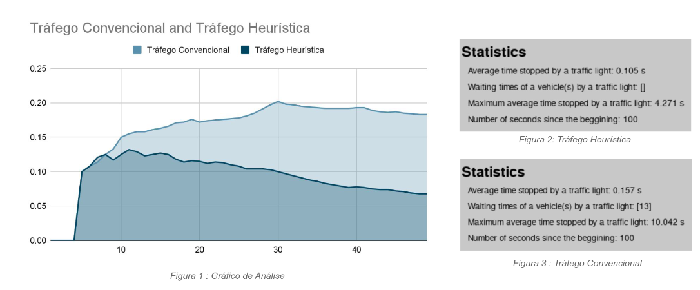

# Multi Agent System Project

Project for the course of [Introduction to Intelligent Autonomous Systems (CC3042)](https://sigarra.up.pt/fcup/en/ucurr_geral.ficha_uc_view?pv_ocorrencia_id=529876) of University of Porto made by [Francisco Ribeiro](https://github.com/franciscoribeiro2003) and [Marisa Azevedo](https://github.com/marisaazevedo).

## Interface:


# Setup

To set up this project, you need to install the necessary dependencies and configure the environment. Here are the steps:

1. Install Python 3.8 or later

2. Install the Python-Spade framework. You can do this by running the following command in your terminal:
   
   ```shell
   pip3 install spade
   ```

3. Set up an XMPP Server for communication between agents. You can use Prosody, for its installation please follow the instructions in here: [Downloading and Installing Prosody – Prosody IM](https://prosody.im/download/start)
   
   When installed run the command `systemctl start prosody` or `prosodyctl restart`

4. Install Pygame. You can do this by running the following command in your terminal:
   
   ```shell
   pip3 install pygame
   ```

5. Clone the project repository [MultiAgentSystem](https://github.com/franciscoribeiro2003/MultiAgentSystem) and navigate into the project directory.

6. Add the users to the XMPP server, if you are using prosody you can run the shell script `adduser.sh`:

```shell
./adduser.sh
```

6. Run the `traffic_environment.py` script to start the simulation:

```bash
python3 traffic_environment.py
```

---

# THEME: A. Multi-Agent Traffic Control Simulation

### Overview

The aim is to design and implement a multi-agent system to efficiently manage traffic across multiple intersections. The agents should communicate with each other and coordinate to manage traffic signals, aiming to minimize waiting times and enhance traffic flow.

### Objectives

Implement intelligent traffic light agents that can adapt to real-time traffic conditions.
Use vehicle agents that generate simplified but realistic traffic patterns.
Integrate these agents to work in a coordinated way to optimize traffic flow.

### Features

Traffic Environment: The environment where the agents live can be based on a grid-like set of roads and intersections.
Traffic Light Agents: Each traffic light intersection is controlled by an agent. The agent manages the light timings (Red, Green, Yellow) based on the current traffic conditions and in coordination with other intersection agents.
Vehicle Agents: Simulate vehicle agents approaching the intersections and reacting to the traffic lights. They can report waiting times and perhaps even request green lights if waiting time exceeds a certain limit.
Central Coordination Agent: This agent gathers data from Traffic Light Agents and perhaps also the Vehicle Agents to manage larger traffic patterns or to intervene in special circumstances (like emergency vehicles coming through).
Emergency Vehicle Priority: Implement a feature where emergency vehicles (ambulance, fire brigade, police) have the highest priority and can interact with the Traffic Light Agents to ensure they get a green light.
Real-Time Adjustments: Traffic light agents could adapt to traffic conditions, perhaps changing the time the light stays green or red based on the traffic volume.
Performance Metrics: Implement metrics to measure the efficiency of traffic management in terms of waiting time, the number of vehicles going through, etc.


# Results

